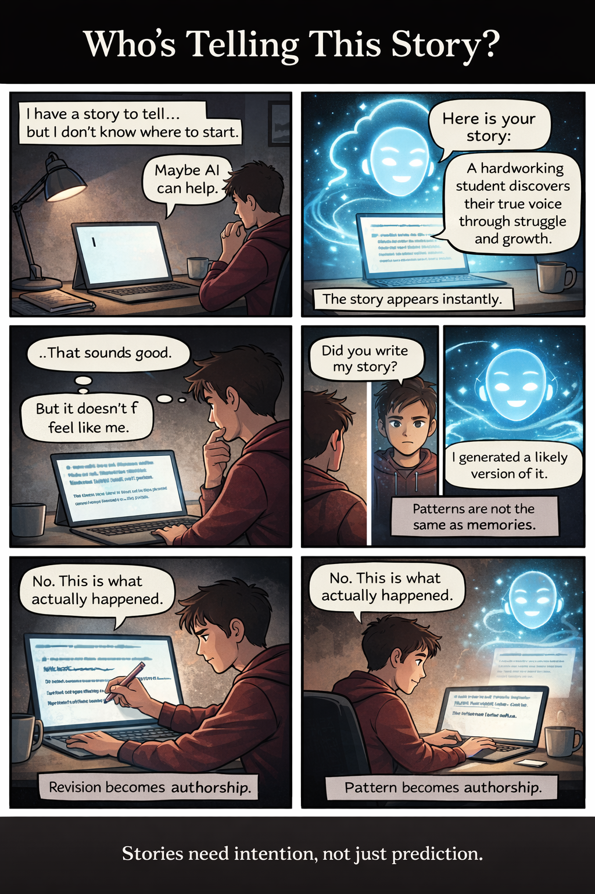

# Comic

## The Artifact
Add your comic image below by placing a file at 
 and keeping this markdown link:

  

Or use plain Markdown:

## Process Notes
- How I made this: I first outlined the idea of a student interacting with AI while trying to write a story. I sketched a 6-panel progression showing emotional shifts: uncertainty, confidence, doubt, confrontation, revision, and resolution. I then used AI to generate dialogue for one panel and edited it to better reflect my own perspective.
- Tools used: AI image generator (for comic layout and visuals), ChatGPT (for dialogue drafting), VS Code (for embedding and formatting).
- Decisions: I chose darker tones in early panels to represent uncertainty and brighter tones in the final panel to symbolize regained authorship. I intentionally made the AI visually large at first and smaller at the end to represent shifting control. I kept dialogue minimal to emphasize the tension between speed and meaning.

## Reflection
In this comic, I wanted to explore the tension between convenience and authorship when using AI in storytelling. At first, the AI appears helpful and efficient. It generates a complete story instantly, presenting something that sounds polished and coherent. That speed creates the illusion that storytelling is simply about producing structured sentences. However, as the student reads the AI-generated narrative, a subtle disconnect emerges. The story sounds correct, but it does not feel personal.
The comic format allowed me to visualize this emotional shift. Instead of explaining the tension in a paragraph, I showed it through posture, lighting, and panel composition. The AI initially appears large and luminous, almost authoritative. By the final panel, it becomes smaller and less dominant. This visual change mirrors the shift in authorship. The student does not reject AI completely but redefines its role.
This project made me realize that AI does not truly “tell” stories. It predicts patterns based on previous narratives. Storytelling requires intention, memory, and lived experience—things that cannot be fully automated. AI can assist, suggest, and accelerate, but it cannot determine meaning. Meaning emerges when I intervene, edit, and decide what reflects my own voice. In that sense, AI becomes a collaborator only when I remain actively present in the creative process.
## Attribution & AI Use
- Tools used: AI image generator (for comic panels), ChatGPT (for dialogue drafting)
- AI prompts (summary): “Generate dialogue for a comic about a student using AI to write a story.”
- What AI generated: Initial visual layout and dialogue drafts.
- What you changed or decided: I edited dialogue for tone and authenticity, structured the narrative arc, determined visual symbolism (AI size, lighting changes), and finalized all wording and thematic direction.
 