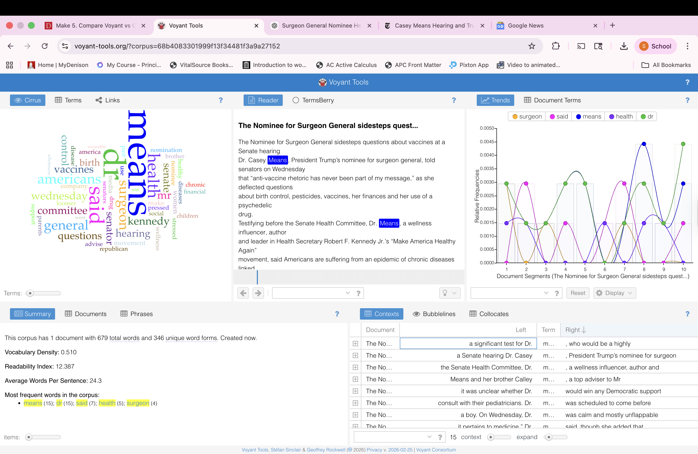
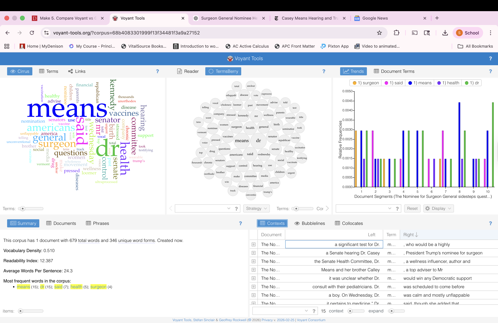

## The Artifact
Article Title: Casey Means Hearing and Trump's State of the Union Speech News
Source: New York Times
## Voyant Analysis

### Word Frequency (Cirrus)

### Word Trends

## GPT Analysis

### Prompt Used

> Provide a rhetorical analysis of the article without focusing on a specific theme.

### GPT Response

## 1. Tone and Narrative Framing

The article adopts a **measured but subtly skeptical tone**. While it maintains journalistic neutrality on the surface, certain word choices and structural decisions shape the reader’s perception of Dr. Means as unconventional and controversial.

For example:
* She is described as a *“wellness influencer”* before being described in professional terms.
* The phrase *“highly unconventional surgeon general”* primes the reader to question her legitimacy.
* The contrast between “nation’s doctor” and “not a practicing physician” creates immediate tension.

The article does not openly criticize her — instead, it lets structure and juxtaposition do the rhetorical work.

## 2. Structural Strategy: Contrast and Juxtaposition

A key rhetorical technique is **juxtaposition**.

### A. Traditional Role vs. Her Background

The article contrasts:
* The formal authority of the Surgeon General
* With Dr. Means’s identity as a wellness influencer and critic of the medical establishment

This tension is central to the article’s framing.

### B. Supportive vs. Deflective Answers

The writer repeatedly shows moments where she:
* Says she supports vaccines
* But refuses to recommend measles vaccination directly

This structure suggests **evasion without directly accusing her of it**.

## 3. Diction and Connotation

Word choice carries subtle evaluative weight.

### Examples:

* **“Sidesteps”** (in the headline)
  → Suggests avoidance rather than engagement. It frames her as evasive before the article begins.

* **“Deflected questions”**
  → Implies deliberate redirection.

* **“Unorthodox side”**
  → Signals deviation from norms.

* **“Wellness influencer”**
  → Carries cultural connotations of social media branding rather than medical authority.

Even though the article is fact-based, these words subtly guide interpretation.

## 4. Ethos, Pathos, and Logos

### A. Ethos (Credibility)

The article questions her ethos indirectly:
* She is not a practicing physician.
* She monetized wellness content.
* She promoted products and received payments.
* She is aligned with Robert F. Kennedy Jr.’s MAHA movement.

These details build a picture that complicates her credibility.

At the same time, the article includes:

* Her calm demeanor
* Her personal grief regarding psilocybin use
* Her willingness to divest financial interests

This prevents the portrayal from becoming one-dimensional.

### B. Pathos (Emotional Appeals)

Dr. Means uses strong emotional language:
> “Our nation is angry, exhausted and hurting…”

This language:
* Broadens the issue from medicine to societal suffering
* Appeals to collective frustration
* Aligns with populist rhetoric

The article includes this quote early, giving her voice emotional force before introducing criticism.

### C. Logos (Argument Structure)
Her core argument is:
* Chronic disease epidemic
* Caused by ultraprocessed food, chemicals, stress, sedentary life

This is presented logically, but the article does not deeply analyze evidence. Instead, it shifts to political and controversial aspects (vaccines, psilocybin, finances).

This structural choice subtly suggests that her controversy outweighs her policy vision.

## 5. Political Framing
The article carefully situates her within:

* President Trump
* Robert F. Kennedy Jr.
* “Make America Healthy Again”
* Laura Loomer
* Bernie Sanders
This creates a **political ecosystem** around her rather than focusing purely on health policy.
This rhetorical move signals that: Her nomination is as much political as medical.

## 6. Use of Irony
There is subtle situational irony:

* The “nation’s doctor” is not practicing medicine.
* A nominee questioned about vaccines refuses to directly recommend measles vaccination during an outbreak.
* A public health figure speaks about spirituality and psychedelics in medicine.

The article doesn’t comment on this irony explicitly — it simply presents it.

## 7. Character Construction
The article constructs Dr. Means as:

* Calm
* Disciplined
* Media-savvy
* Controversial
* Ideologically aligned with a broader movement
* Commercially entangled
Rather than portraying her as extreme, the article portrays her as strategically careful.

## 8. Implied Themes
Several deeper themes emerge:

### A. Authority vs. Anti-Establishment Medicine
She critiques the medical establishment yet seeks to lead national public health.

### B. Commercialization of Wellness
Her monetization complicates public trust.

### C. Science vs. Individual Choice
Her repeated emphasis on “parents consulting pediatricians” shifts responsibility from public recommendation to private decision-making.

## 9. Overall Rhetorical Effect
The article achieves a balance:
* It avoids overt editorializing.
* It uses framing, diction, and structure to suggest skepticism.
* It presents both her claims and the tensions surrounding them.
The reader is left with:
* A sense that she is politically viable
* But professionally unconventional
* And rhetorically cautious

## Process Notes
How did you make this?
- I first selected a recent news article about Dr. Casey Means’ Senate hearing. I copied the full text and uploaded it into Voyant Tools to generate visualizations. I analyzed the word frequency (Cirrus), trends graph, and summary statistics. After reviewing the patterns in Voyant, I then asked GPT to provide a rhetorical analysis of the same article without focusing on a specific theme. Finally, I compared how Voyant and GPT interpreted the text differently and wrote a reflection on their approaches to meaning.
What tools did you use?
- Voyant Tools (for distant reading and visualization)
ChatGPT (for rhetorical analysis)
Visual Studio Code (for formatting and embedding images in markdown)
GitHub Pages (for publishing the final file)
What decisions did you make?
- I decided to focus on the Cirrus word cloud and Trends visualization because they clearly showed patterns in repetition and distribution. I chose not to include every visualization Voyant generated in order to keep the analysis focused. For GPT, I deliberately used a neutral prompt that did not guide it toward a specific theme, so I could observe how it independently interpreted tone and framing. I also chose to compare how frequency-based analysis differs from rhetorical interpretation.

## Reflection
Respond to this week’s reflection prompt in 200–300 words.
When machines “read” literature or journalism for us, we gain speed, pattern recognition, and scale. Voyant quickly reveals structural features that might not be obvious during close reading, such as repetition of names, reporting verbs like “said,” and the distribution of institutional terms. It allows us to see patterns objectively and quantitatively. However, Voyant cannot understand tone, irony, political context, or rhetorical framing. It treats meaning as measurable frequency rather than interpretation.

GPT, on the other hand, imagines meaning as narrative and argument. It analyzes tone, framing, juxtaposition, and credibility. It can identify rhetorical strategies and implied tensions that Voyant cannot detect. However, GPT may over-interpret or impose coherence that is not fully supported by the text. It reads like a literary critic, but it is still constructing meaning algorithmically.

The main difference is that Voyant sees meaning as repetition and distribution, while GPT sees meaning as structure and intention. Voyant reads statistically; GPT reads rhetorically. Together, they demonstrate that “reading” is not neutral — it depends on what we define as meaningful. Machines do not replace human interpretation, but they reshape how we approach and understand texts.

## Attribution & AI Use
- Tools used: Voyant Tools, ChatGPT, Visual Studio Code
- AI prompts (summary): I asked GPT to provide a rhetorical analysis of the article without focusing on a specific theme.
- What AI generated: GPT produced the full rhetorical analysis, including discussion of tone, structure, diction, and political framing.
- What you changed or decided: I selected which Voyant visualizations to include, interpreted the results in my own words, structured the comparison, and edited the GPT analysis for clarity and organization.