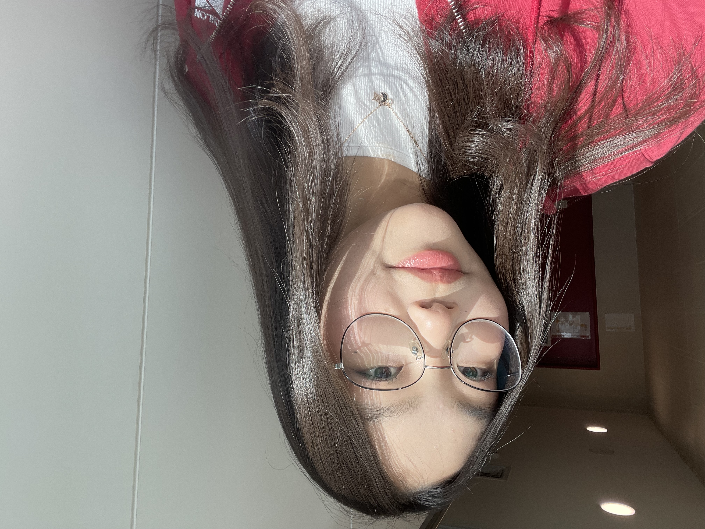
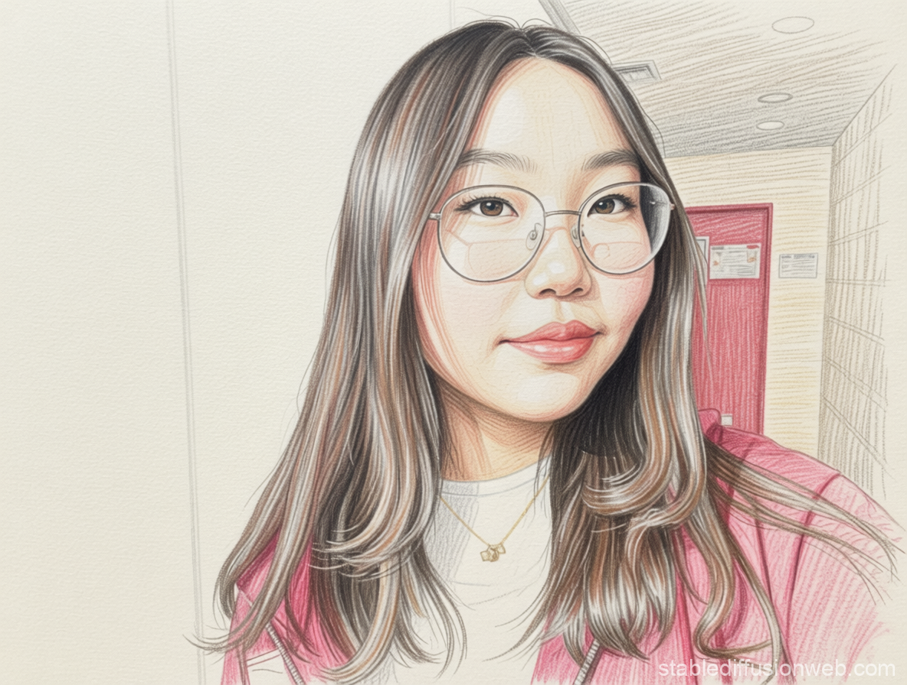
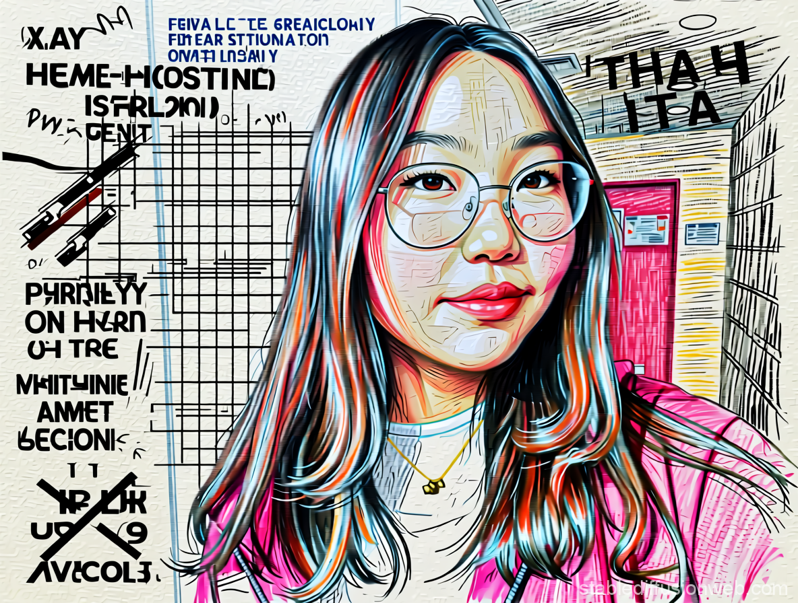

# Week 3 – Selfie & Identity

## The Artifact
This project explores how AI interprets identity through image generation. Using a real selfie, I created stylized and distorted AI versions of myself to examine how AI recognizes faces through patterns and aesthetics rather than personal identity. The project highlights the tension between human individuality and algorithmic representation. 

  
  
  

## Process Notes
How did you make this?
- I uploaded a real photo of myself into an AI image generator and used prompts to create a stylized AI After generating the first image, I created a second version by prompting the AI to exaggerate visual elements such as color, texture, and line work in order to distort the image.
What tools did you use?
- Stable Diffusion, Github, Visual Studio Code.
What decisions did you make?
- I chose a straightforward selfie with neutral lighting so my facial features were clearly visible. For the second image, I intentionally increased distortion and stylization to move the image further away from realism and emphasize the AIselfie.qualities that are central to how I understand myself. The AI presents a version of me that feels generic, as though it could easily belong to someone else with
similar features. This absence highlights how AI systems prioritize visual patterns over inner identity. The second image exaggerates this distance even more. Through distortion and heavy stylization, my face becomes less human and more illustrative, almost symbolic. While I intentionally intervened to disrupt realism, the result emphasizes how easily my identity can be transformed into something aesthetic rather than personal. In this version, I see myself less as an individual and more as data being reshaped. Together, the images reveal how AI can represent me visually while simultaneously erasing the complexity that makes me who I am.

## Reflection
This project made me think more critically about the relationship between AI, identity, and representation. By using AI to transform a real selfie into stylized and distorted versions, I was able to see how AI systems interpret people through patterns rather than individuality. Although the generated images still resembled me visually, they felt disconnected from my actual personality and identity. The AI focused on recognizable facial features and aesthetics, but it could not capture emotions, experiences, or the more personal aspects that make someone unique. 

The second distorted image especially emphasized this feeling. As the AI exaggerated colors, textures, and shapes, my face became more symbolic and less human. This process showed me how easily identity can become simplified or transformed when filtered through computational systems. At the same time, the project also demonstrated how powerful AI tools can be creatively. Small prompt changes dramatically altered the final result, showing how human decisions still shape the outputs generated by AI. 

Overall, this assignment helped me understand that AI-generated images are not neutral reproductions of reality. They are interpretations built from data, algorithms, and design choices. The project raised questions for me about authenticity, authorship, and how technology influences the way we present ourselves online.

## Attribution & AI Use
- Tools used: Stable Diffusion(via web interface), Github, Visual Studio Code.
- AI prompts (summary): I uploaded a real photo of myself and prompted the AI to generate a stylized selfie based on my facial features, glasses, and overall appearance. For the second image, I prompted the AI to exaggerate colors, lines, and textures to create a more distorted and graphic version.
- What AI generated: The AI generated both selfie images, including facial structure, coloring, and stylistic effects.
- What you changed or decided: I chose the original photo, selected and refined the prompts, and decided how the second image would be distorted to emphasize stylization and loss of realism. I also selected which images to include and how to frame them within the assignment.
